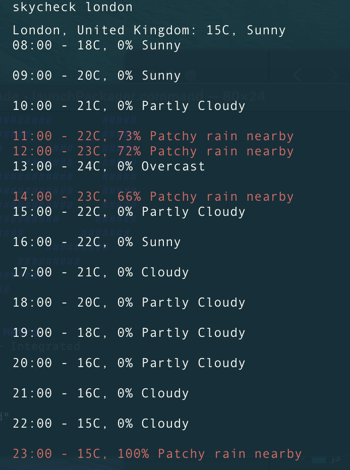
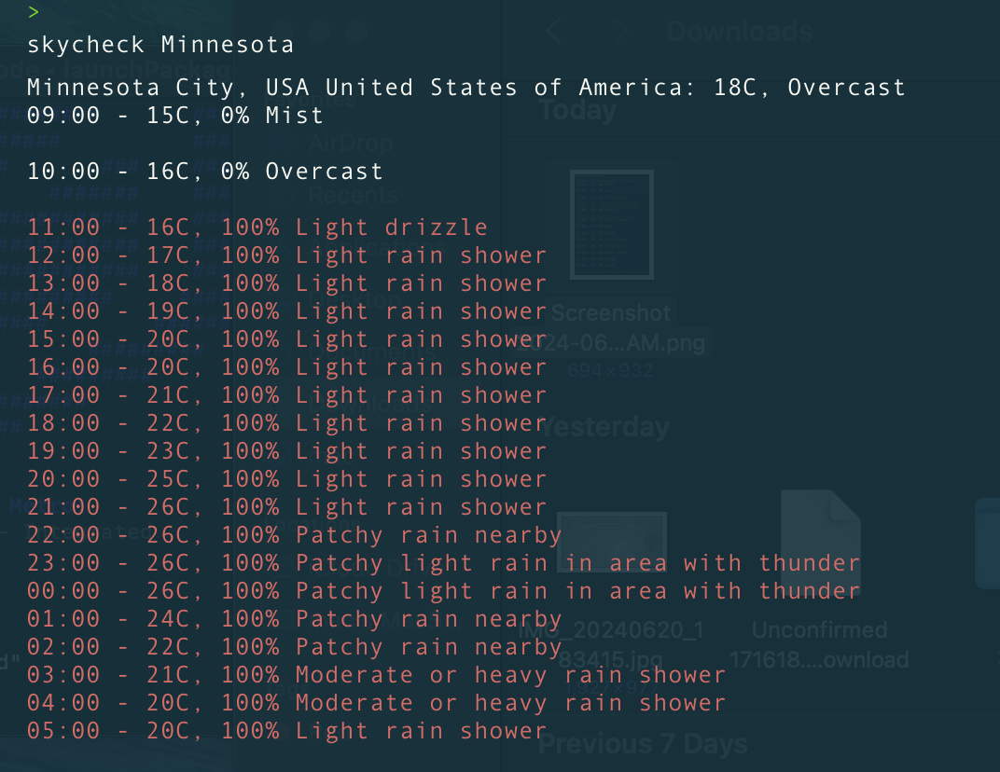

# SkyCheck

[](LICENSE)
[](https://github.com/DevXanderCode/skycheck/stargazers)
[](https://github.com/DevXanderCode/skycheck/network/members)
[](https://github.com/DevXanderCode/skycheck/issues)

SkyCheck is a powerful and intuitive weather application that provides real-time weather information for any location. Get up-to-date weather forecasts, current conditions, and detailed data to help you plan your day.

## Features

- **Real-time Weather Updates**: Get the latest weather updates for your current location or any city worldwide.
- **Detailed Forecasts**: View detailed weather forecasts for the next 7 days.
- **Weather Alerts**: Receive alerts for severe weather conditions.
- **Customizable Interface**: Personalize the app's interface to match your preferences.
- **Multi-language Support**: Available in multiple languages for a global user base.

## Screenshots




## Installation

### Prerequisites

- Go (>=1.16)

### Clone the Repository

```bash
git clone https://github.com/DevXanderCode/skycheck.git
cd skycheck

```

## Usage

1. **Search for a Location**: Use the skycheck command followed by the city name to find weather information for any city.
2. **View Current Weather**: See the current temperature, chance of rain and weather conditions.
3. **Check the Forecast**: Navigate to the forecast section for weather predictions for the next few days.

## Contributing

We welcome contributions! Follow these steps to contribute:

1. Fork the repository.
2. Create a new branch (`git checkout -b feature-branch`).
3. Make your changes and commit them (`git commit -m 'Add new feature'`).
4. Push to the branch (`git push origin feature-branch`).
5. Open a pull request.

<!-- For detailed information, refer to our [Contributing Guide](CONTRIBUTING.md). -->
